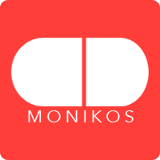

# Monikos

Monikos is a mobile/web-based study app for pharmacy school students built on AngularJS.

## Demo

[View Live](http://www.danilachenchik.com/mvc/public/account/login)

[Download Zip](https://github.com/chenchik/monikos/archive/develop.zip)

## Introduction

Memorizing and remembering over 200 drugs is difficult! Current pharmacy students have to go to a database to look up these drugs, they then have to take the time to manually make flash cards or put this information into a Quizlet. There is nothing about this process that stimulates sustained learning. The Monikos application is a unique solution to poor retention rates of critical, yet simple information.

## Built With

- [Bootstrap](http://getbootstrap.com/) - provided styling for our games and content
- [jQuery](https://jquery.com/) - used to game-ify our app with interactive elements
- [AngularJS](https://angularjs.org/) - modularized our application and let us dynamically interact with our database
- [Checklist-Model](https://github.com/vitalets/checklist-model) - allowed us to store multiple objects in one model to make our list objects

